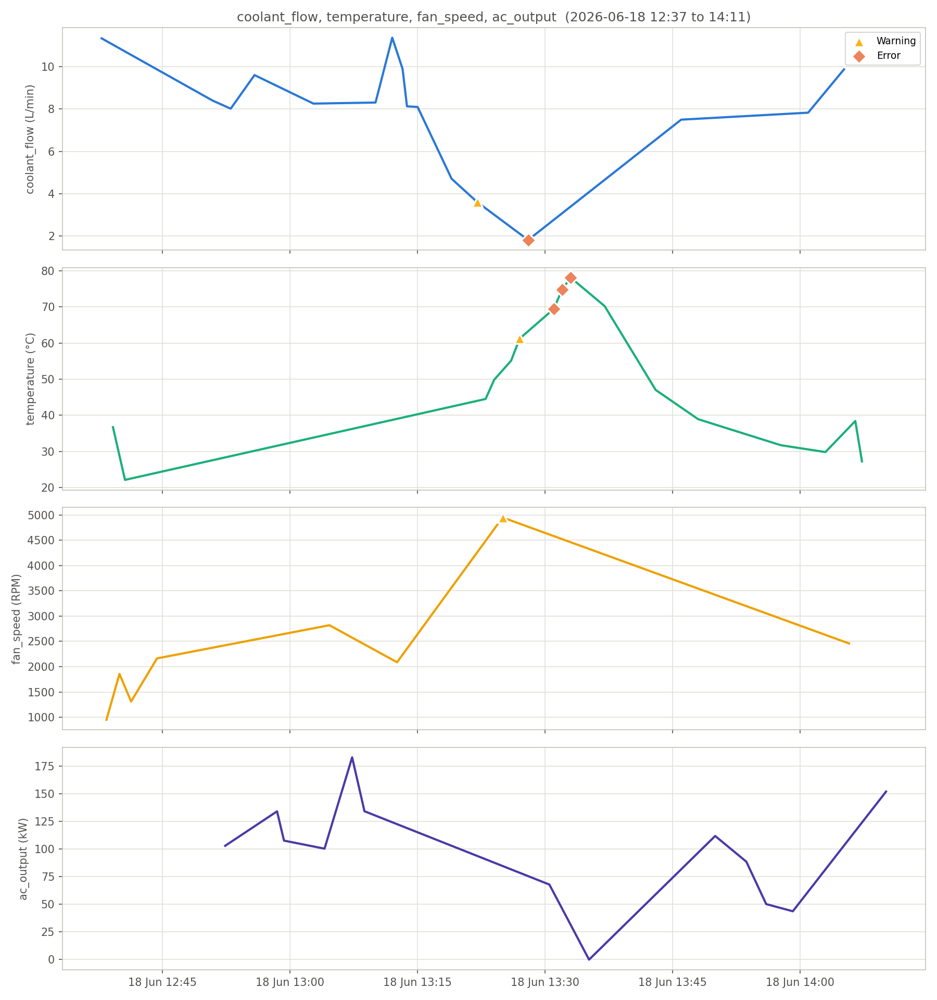
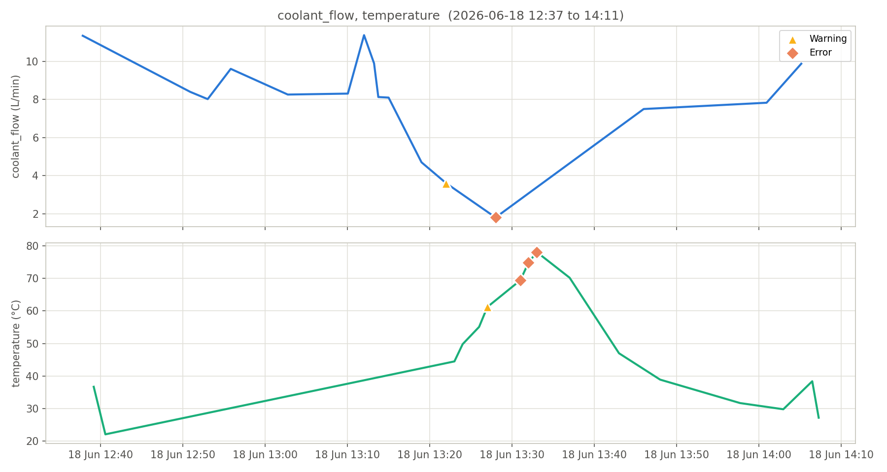

# Agent harness transcript

Generated by `python -m agent.run_demo` over `outputs/logs.db` (the three prompts required by the assignment).

## Prompt 1

> Summarize the thermal anomalies today and what likely caused them.

**Mode:** llm (claude-haiku-4-5)

**Tool call 1:** `summarize_incident({"date": "2026-06-18"})`

```json
{
  "episode": {
    "rank": 1,
    "start": "2026-06-18 13:22:00",
    "end": "2026-06-18 13:35:00",
    "alert_span_min": 13.0,
    "alerts": {
      "warning": 5,
      "error": 5,
      "critical": 2
    },
    "severity_score": 50,
    "subsystems": [
      "BMS",
      "Inverter",
      "Site",
      "Thermal"
    ],
    "issue_types": [
      "coolant_flow_loss",
      "protective_shutdown",
      "thermal_event"
    ],
    "classification": "INTERNAL fault, protective trip",
    "evidence": "cross-subsystem escalation (BMS, Inverter, Site, Thermal) ending in a protective shutdown; back online at 13:51:00"
  },
  "all_episodes": [
    {
      "rank": 1,
      "start": "2026-06-18 13:22:00",
      "end": "2026-06-18 13:35:00",
      "alert_span_min": 13.0,
      "alerts": {
        "warning": 5,
        "error": 5,
        "critical": 2
      },
      "severity_score": 50,
      "subsystems": [
        "BMS",
        "Inverter",
        "Site",
        "Thermal"
      ],
      "issue_types": [
        "coolant_flow_loss",
        "protective_shutdown",
        "thermal_event"
      ],
      "classification": "INTERNAL fault, protective trip",
      "evidence": "cross-subsystem escalation (BMS, Inverter, Site, Thermal) ending in a protective shutdown; back online at 13:51:00"
    },
    {
      "rank": 2,
      "start": "2026-06-17 12:04:00",
      "end": "2026-06-17 16:04:00",
      "alert_span_min": 240.0,
      "alerts": {
        "warning": 24,
        "error": 2,
        "critical": 0
      },
      "severity_score": 34,
      "subsystems": [
        "BMS",
        "Battery"
      ],
      "issue_types": [
        "cell_imbalance",
        "soc_mismatch",
        "voltage_drop"
      ],
      "classification": "INTERNAL fault, unresolved",
      "evidence": "progressive on-board degradation with no recovery marker; ends flagged for inspection, needs intervention"
    },
    {
      "rank": 3,
      "start": "2026-06-16 08:31:20",
      "end": "2026-06-16 08:34:14",
      "alert_span_min": 2.9,
      "alerts": {
        "warning": 7,
        "error": 0,
        "critical": 0
      },
      "severity_score": 7,
      "subsystems": [
        "Inverter"
      ],
      "issue_types": [
        "grid_sync_instability"
      ],
      "classification": "EXTERNAL, self-resolving",
      "evidence": "all alerts are grid-side signals; no internal subsystem alerted; re-synced without intervention at 08:37:34 ('Grid sync established')"
    }
  ],
  "timeline": [
    {
      "time": "2026-06-18 13:22:00",
      "subsystem": "Thermal",
      "severity": "WARNING",
      "message": "Coolant loop flow low: 3.60 L/min"
    },
    {
      "time": "2026-06-18 13:25:00",
      "subsystem": "Thermal",
      "severity": "WARNING",
      "message": "Fan at maximum speed: 4950 RPM"
    },
    {
      "time": "2026-06-18 13:27:00",
      "subsystem": "Thermal",
      "severity": "WARNING",
      "message": "Temperature approaching safe threshold: 61.2°C"
    },
    {
      "time": "2026-06-18 13:28:00",
      "subsystem": "Thermal",
      "severity": "ERROR",
      "message": "Coolant flow below minimum threshold: 1.80 L/min"
    },
    {
      "time": "2026-06-18 13:29:00",
      "subsystem": "BMS",
      "severity": "WARNING",
      "message": "Thermal derate applied"
    },
    {
      "time": "2026-06-18 13:30:00",
      "subsystem": "Inverter",
      "severity": "WARNING",
      "message": "Power derated due to thermal limit: 70 kW"
    },
    {
      "time": "2026-06-18 13:31:00",
      "subsystem": "Thermal",
      "severity": "ERROR",
      "message": "Temperature exceeded safe threshold: 69.4°C"
    },
    {
      "time": "2026-06-18 13:32:00",
      "subsystem": "Thermal",
      "severity": "ERROR",
      "message": "Temperature exceeded safe threshold: 74.8°C"
    },
    "... (9 more items truncated)"
  ],
  "timings": {
    "first_warning": "2026-06-18 13:22:00",
    "first_error": "2026-06-18 13:28:00",
    "trip": "2026-06-18 13:34:30",
    "site_offline": "2026-06-18 13:35:00",
    "recovered": "2026-06-18 13:51:00",
    "warning_to_trip_min": 12.5,
    "downtime_min": 16.0,
    "first_warning_to_recovery_min": 29.0
  },
  "root_cause": "First fault signal: 'Coolant loop flow low: 3.60 L/min' (Thermal, 2026-06-18 13:22:00). INTERNAL fault, protective trip: cross-subsystem escalation (BMS, Inverter, Site, Thermal) ending in a protective shutdown; back online at 13:51:00.",
  "evidence_chart": "outputs\\agent_plot_coolant_flow_temperature_fan_speed_ac_output.png"
}
```



**Answer:**

## Summary of Today's Thermal Anomalies

**Primary Incident: Coolant Flow Loss Leading to Protective Shutdown**
- **Timeline**: 13:22 – 13:51 on 2026-06-18 (29 minutes total; 16 minutes offline)
- **Root Cause**: Coolant loop flow dropped from 3.60 L/min to 1.80 L/min at 13:22, triggering a cascade of protective responses
- **Sequence of Events**:
  1. **13:22** – Coolant flow warning (3.60 L/min)
  2. **13:25** – Fan maxed out (4950 RPM) attempting to cool
  3. **13:27** – Temperature approaching threshold (61.2°C)
  4. **13:28** – Coolant flow dropped below minimum (1.80 L/min) → ERROR
  5. **13:29–13:30** – Thermal derate applied; power reduced to 70 kW
  6. **13:31–13:33** – Temperature exceeded safe thresholds (69.4°C → 74.8°C)
  7. **13:33** – Module 7 overtemperature fault (78.1°C)
  8. **13:34** – Inverter trip and shutdown initiated
  9. **13:35** – Site went offline (protective shutdown)
  10. **13:45–13:51** – Coolant pump restarted; system recovered and came back online

**Classification**: INTERNAL fault with cross-subsystem escalation (BMS, Inverter, Site, Thermal)

**Evidence Chart**: `outputs\agent_plot_coolant_flow_temperature_fan_speed_ac_output.png`

**Likely Cause**: Coolant pump failure or blockage prevented adequate heat removal, causing temperatures to climb uncontrollably. The protective shutdown at 13:35 prevented thermal damage. Recovery required manual coolant pump restart at 13:45.

## Prompt 2

> Plot coolant flow and temperature around the incident and highlight warnings.

**Mode:** llm (claude-haiku-4-5)

**Tool call 1:** `summarize_incident({})`

```json
{
  "episode": {
    "rank": 1,
    "start": "2026-06-18 13:22:00",
    "end": "2026-06-18 13:35:00",
    "alert_span_min": 13.0,
    "alerts": {
      "warning": 5,
      "error": 5,
      "critical": 2
    },
    "severity_score": 50,
    "subsystems": [
      "BMS",
      "Inverter",
      "Site",
      "Thermal"
    ],
    "issue_types": [
      "coolant_flow_loss",
      "protective_shutdown",
      "thermal_event"
    ],
    "classification": "INTERNAL fault, protective trip",
    "evidence": "cross-subsystem escalation (BMS, Inverter, Site, Thermal) ending in a protective shutdown; back online at 13:51:00"
  },
  "all_episodes": [
    {
      "rank": 1,
      "start": "2026-06-18 13:22:00",
      "end": "2026-06-18 13:35:00",
      "alert_span_min": 13.0,
      "alerts": {
        "warning": 5,
        "error": 5,
        "critical": 2
      },
      "severity_score": 50,
      "subsystems": [
        "BMS",
        "Inverter",
        "Site",
        "Thermal"
      ],
      "issue_types": [
        "coolant_flow_loss",
        "protective_shutdown",
        "thermal_event"
      ],
      "classification": "INTERNAL fault, protective trip",
      "evidence": "cross-subsystem escalation (BMS, Inverter, Site, Thermal) ending in a protective shutdown; back online at 13:51:00"
    },
    {
      "rank": 2,
      "start": "2026-06-17 12:04:00",
      "end": "2026-06-17 16:04:00",
      "alert_span_min": 240.0,
      "alerts": {
        "warning": 24,
        "error": 2,
        "critical": 0
      },
      "severity_score": 34,
      "subsystems": [
        "BMS",
        "Battery"
      ],
      "issue_types": [
        "cell_imbalance",
        "soc_mismatch",
        "voltage_drop"
      ],
      "classification": "INTERNAL fault, unresolved",
      "evidence": "progressive on-board degradation with no recovery marker; ends flagged for inspection, needs intervention"
    },
    {
      "rank": 3,
      "start": "2026-06-16 08:31:20",
      "end": "2026-06-16 08:34:14",
      "alert_span_min": 2.9,
      "alerts": {
        "warning": 7,
        "error": 0,
        "critical": 0
      },
      "severity_score": 7,
      "subsystems": [
        "Inverter"
      ],
      "issue_types": [
        "grid_sync_instability"
      ],
      "classification": "EXTERNAL, self-resolving",
      "evidence": "all alerts are grid-side signals; no internal subsystem alerted; re-synced without intervention at 08:37:34 ('Grid sync established')"
    }
  ],
  "timeline": [
    {
      "time": "2026-06-18 13:22:00",
      "subsystem": "Thermal",
      "severity": "WARNING",
      "message": "Coolant loop flow low: 3.60 L/min"
    },
    {
      "time": "2026-06-18 13:25:00",
      "subsystem": "Thermal",
      "severity": "WARNING",
      "message": "Fan at maximum speed: 4950 RPM"
    },
    {
      "time": "2026-06-18 13:27:00",
      "subsystem": "Thermal",
      "severity": "WARNING",
      "message": "Temperature approaching safe threshold: 61.2°C"
    },
    {
      "time": "2026-06-18 13:28:00",
      "subsystem": "Thermal",
      "severity": "ERROR",
      "message": "Coolant flow below minimum threshold: 1.80 L/min"
    },
    {
      "time": "2026-06-18 13:29:00",
      "subsystem": "BMS",
      "severity": "WARNING",
      "message": "Thermal derate applied"
    },
    {
      "time": "2026-06-18 13:30:00",
      "subsystem": "Inverter",
      "severity": "WARNING",
      "message": "Power derated due to thermal limit: 70 kW"
    },
    {
      "time": "2026-06-18 13:31:00",
      "subsystem": "Thermal",
      "severity": "ERROR",
      "message": "Temperature exceeded safe threshold: 69.4°C"
    },
    {
      "time": "2026-06-18 13:32:00",
      "subsystem": "Thermal",
      "severity": "ERROR",
      "message": "Temperature exceeded safe threshold: 74.8°C"
    },
    "... (9 more items truncated)"
  ],
  "timings": {
    "first_warning": "2026-06-18 13:22:00",
    "first_error": "2026-06-18 13:28:00",
    "trip": "2026-06-18 13:34:30",
    "site_offline": "2026-06-18 13:35:00",
    "recovered": "2026-06-18 13:51:00",
    "warning_to_trip_min": 12.5,
    "downtime_min": 16.0,
    "first_warning_to_recovery_min": 29.0
  },
  "root_cause": "First fault signal: 'Coolant loop flow low: 3.60 L/min' (Thermal, 2026-06-18 13:22:00). INTERNAL fault, protective trip: cross-subsystem escalation (BMS, Inverter, Site, Thermal) ending in a protective shutdown; back online at 13:51:00.",
  "evidence_chart": "outputs\\agent_plot_coolant_flow_temperature_fan_speed_ac_output.png"
}
```


**Tool call 2:** `plot_signals({"metrics": ["coolant_flow", "temperature"], "start": "2026-06-18 13:15:00", "end": "2026-06-18 13:55:00", "highlight_alerts": true, "around_incident": true})`

```json
{
  "chart_path": "outputs\\agent_plot_coolant_flow_temperature.png",
  "metrics": [
    "coolant_flow",
    "temperature"
  ],
  "skipped_sparse": {},
  "n_points": {
    "coolant_flow": 17,
    "temperature": 17
  },
  "window": [
    "2026-06-18 12:37:00",
    "2026-06-18 14:11:00"
  ],
  "alerts_highlighted": true
}
```



**Answer:**

**Chart: coolant flow and temperature around incident**

**Path:** `outputs\agent_plot_coolant_flow_temperature.png`

**Key findings:**
- **Coolant flow collapse:** Flow dropped from ~4.5 L/min to 3.6 L/min at 13:22, then fell below minimum (1.8 L/min) by 13:28—triggering cascading thermal warnings.
- **Temperature escalation:** System temp climbed from ~54°C to 74.8°C (13:32), with Module 7 reaching 78.1°C—exceeding safe threshold and forcing protective shutdown at 13:34:30.
- **Recovery timeline:** Coolant pump restarted at 13:45, thermal derate cleared by 13:47, and site back online at 13:51 (total downtime: 16 min).

The chart shows warnings and errors highlighted across both metrics during the incident window (12:37–14:11).

## Prompt 3

> Draft a service ticket for the most severe issue: root cause, affected subsystem, recommended action.

**Mode:** llm (claude-haiku-4-5)

**Tool call 1:** `summarize_incident({})`

```json
{
  "episode": {
    "rank": 1,
    "start": "2026-06-18 13:22:00",
    "end": "2026-06-18 13:35:00",
    "alert_span_min": 13.0,
    "alerts": {
      "warning": 5,
      "error": 5,
      "critical": 2
    },
    "severity_score": 50,
    "subsystems": [
      "BMS",
      "Inverter",
      "Site",
      "Thermal"
    ],
    "issue_types": [
      "coolant_flow_loss",
      "protective_shutdown",
      "thermal_event"
    ],
    "classification": "INTERNAL fault, protective trip",
    "evidence": "cross-subsystem escalation (BMS, Inverter, Site, Thermal) ending in a protective shutdown; back online at 13:51:00"
  },
  "all_episodes": [
    {
      "rank": 1,
      "start": "2026-06-18 13:22:00",
      "end": "2026-06-18 13:35:00",
      "alert_span_min": 13.0,
      "alerts": {
        "warning": 5,
        "error": 5,
        "critical": 2
      },
      "severity_score": 50,
      "subsystems": [
        "BMS",
        "Inverter",
        "Site",
        "Thermal"
      ],
      "issue_types": [
        "coolant_flow_loss",
        "protective_shutdown",
        "thermal_event"
      ],
      "classification": "INTERNAL fault, protective trip",
      "evidence": "cross-subsystem escalation (BMS, Inverter, Site, Thermal) ending in a protective shutdown; back online at 13:51:00"
    },
    {
      "rank": 2,
      "start": "2026-06-17 12:04:00",
      "end": "2026-06-17 16:04:00",
      "alert_span_min": 240.0,
      "alerts": {
        "warning": 24,
        "error": 2,
        "critical": 0
      },
      "severity_score": 34,
      "subsystems": [
        "BMS",
        "Battery"
      ],
      "issue_types": [
        "cell_imbalance",
        "soc_mismatch",
        "voltage_drop"
      ],
      "classification": "INTERNAL fault, unresolved",
      "evidence": "progressive on-board degradation with no recovery marker; ends flagged for inspection, needs intervention"
    },
    {
      "rank": 3,
      "start": "2026-06-16 08:31:20",
      "end": "2026-06-16 08:34:14",
      "alert_span_min": 2.9,
      "alerts": {
        "warning": 7,
        "error": 0,
        "critical": 0
      },
      "severity_score": 7,
      "subsystems": [
        "Inverter"
      ],
      "issue_types": [
        "grid_sync_instability"
      ],
      "classification": "EXTERNAL, self-resolving",
      "evidence": "all alerts are grid-side signals; no internal subsystem alerted; re-synced without intervention at 08:37:34 ('Grid sync established')"
    }
  ],
  "timeline": [
    {
      "time": "2026-06-18 13:22:00",
      "subsystem": "Thermal",
      "severity": "WARNING",
      "message": "Coolant loop flow low: 3.60 L/min"
    },
    {
      "time": "2026-06-18 13:25:00",
      "subsystem": "Thermal",
      "severity": "WARNING",
      "message": "Fan at maximum speed: 4950 RPM"
    },
    {
      "time": "2026-06-18 13:27:00",
      "subsystem": "Thermal",
      "severity": "WARNING",
      "message": "Temperature approaching safe threshold: 61.2°C"
    },
    {
      "time": "2026-06-18 13:28:00",
      "subsystem": "Thermal",
      "severity": "ERROR",
      "message": "Coolant flow below minimum threshold: 1.80 L/min"
    },
    {
      "time": "2026-06-18 13:29:00",
      "subsystem": "BMS",
      "severity": "WARNING",
      "message": "Thermal derate applied"
    },
    {
      "time": "2026-06-18 13:30:00",
      "subsystem": "Inverter",
      "severity": "WARNING",
      "message": "Power derated due to thermal limit: 70 kW"
    },
    {
      "time": "2026-06-18 13:31:00",
      "subsystem": "Thermal",
      "severity": "ERROR",
      "message": "Temperature exceeded safe threshold: 69.4°C"
    },
    {
      "time": "2026-06-18 13:32:00",
      "subsystem": "Thermal",
      "severity": "ERROR",
      "message": "Temperature exceeded safe threshold: 74.8°C"
    },
    "... (9 more items truncated)"
  ],
  "timings": {
    "first_warning": "2026-06-18 13:22:00",
    "first_error": "2026-06-18 13:28:00",
    "trip": "2026-06-18 13:34:30",
    "site_offline": "2026-06-18 13:35:00",
    "recovered": "2026-06-18 13:51:00",
    "warning_to_trip_min": 12.5,
    "downtime_min": 16.0,
    "first_warning_to_recovery_min": 29.0
  },
  "root_cause": "First fault signal: 'Coolant loop flow low: 3.60 L/min' (Thermal, 2026-06-18 13:22:00). INTERNAL fault, protective trip: cross-subsystem escalation (BMS, Inverter, Site, Thermal) ending in a protective shutdown; back online at 13:51:00.",
  "evidence_chart": "outputs\\agent_plot_coolant_flow_temperature_fan_speed_ac_output.png"
}
```


**Tool call 2:** `draft_service_ticket({"rank": 1})`

```json
{
  "ticket_id": "MP-20260618-001",
  "severity_rank": 1,
  "title": "Coolant-flow loss -> overtemperature -> protective shutdown (Module 7)",
  "priority": "P1",
  "status": "OPEN",
  "site": "Megapack site (MP_Logs)",
  "affected_subsystems": [
    "BMS",
    "Inverter",
    "Site",
    "Thermal"
  ],
  "affected_modules": [
    7
  ],
  "issue_types": [
    "coolant_flow_loss",
    "protective_shutdown",
    "thermal_event"
  ],
  "classification": "INTERNAL fault, protective trip",
  "root_cause": "First fault signal: 'Coolant loop flow low: 3.60 L/min' (Thermal, 2026-06-18 13:22:00). INTERNAL fault, protective trip: cross-subsystem escalation (BMS, Inverter, Site, Thermal) ending in a protective shutdown; back online at 13:51:00.",
  "first_warning": "2026-06-18 13:22:00",
  "trip": "2026-06-18 13:34:30",
  "recovered": "2026-06-18 13:51:00",
  "warning_to_trip_min": 12.5,
  "downtime_min": 16.0,
  "evidence": [
    "13:22:00 [Thermal/WARNING] Coolant loop flow low: 3.60 L/min",
    "13:25:00 [Thermal/WARNING] Fan at maximum speed: 4950 RPM",
    "13:27:00 [Thermal/WARNING] Temperature approaching safe threshold: 61.2°C",
    "13:28:00 [Thermal/ERROR] Coolant flow below minimum threshold: 1.80 L/min",
    "13:29:00 [BMS/WARNING] Thermal derate applied",
    "13:30:00 [Inverter/WARNING] Power derated due to thermal limit: 70 kW",
    "13:31:00 [Thermal/ERROR] Temperature exceeded safe threshold: 69.4°C",
    "13:32:00 [Thermal/ERROR] Temperature exceeded safe threshold: 74.8°C",
    "... (4 more items truncated)"
  ],
  "attachment_chart": "outputs\\agent_plot_coolant_flow_temperature_fan_speed_ac_output.png",
  "recommended_actions": [
    "Inspect and service/replace the coolant pump; verify loop pressure and check for leaks or blockages before restart.",
    "Run the safe-restart checklist and confirm all derates cleared before returning the site to full dispatch.",
    "Verify thermal sensors and fan operation; review temperature trends after the coolant loop is serviced."
  ],
  "rendered_text": "SERVICE TICKET MP-20260618-001  [P1]\nTitle: Coolant-flow loss -> overtemperature -> protective shutdown (Module 7)\nAffected subsystems: BMS, Inverter, Site, Thermal\nIssue types: coolant_flow_loss, protective_shutdown, thermal_event\nRoot cause: First fault signal: 'Coolant loop flow low: 3.60 L/min' (Thermal, 2026-06-18 13:22:00). INTERNAL fault, protective trip: cross-subsystem escalation (BMS, Inverter, Site, Thermal) ending in a protective shutdown; back online at 13:51:00.\nTimeline: first warning 2026-06-18 13:22:00 -> trip 2026-06-18 13:34:30 (12.5 min) -> recovered 2026-06-18 13:51:00 (downtime 16 min)\nRecommended actions:\n  - Inspect and service/replace the coolant pump; verify loop pressure and check for leaks or blockages before restart.\n  - Run the safe-restart checklist and confirm all derates cleared before returning the site to full dispatch.\n  - Verify thermal sensors and fan operation; review temperature trends after the coolant loop is serviced.\nAttachment: outputs\\agent_plot_coolant_flow_temperature_fan_speed_ac_output.png (coolant_flow, temperature, fan_speed, ac_output around the episode, alerts highlighted)"
}
```


**Answer:**

## Service Ticket MP-20260618-001 [P1]

**Title:** Coolant-flow loss → overtemperature → protective shutdown (Module 7)

**Root Cause:**  
Coolant loop flow dropped to 3.60 L/min at 13:22:00 on 2026-06-18, preventing heat removal and triggering a cascading thermal fault. Temperature in Module 7 reached 78.1°C, causing inverter thermal protection shutdown at 13:34:30.

**Affected Subsystems & Modules:**  
- **Subsystems:** Thermal, BMS, Inverter, Site  
- **Module:** 7

**Timeline:**
- First warning (low flow): 13:22:00
- Flow dropped below minimum (1.80 L/min): 13:28:00
- Module 7 overtemperature (78.1°C): 13:33:00
- Inverter shutdown: 13:34:30
- Site offline: 13:35:00
- Recovered: 13:51:00
- **Downtime: 16 minutes**

**Recommended Actions:**
1. **Inspect and service/replace the coolant pump** – verify loop pressure and check for leaks or blockages before restart.
2. **Run safe-restart checklist** – confirm all thermal derates cleared before returning to full dispatch.
3. **Verify thermal sensors and fan operation** – review temperature trends post-service to confirm recovery.

**Evidence Chart:** `outputs\agent_plot_coolant_flow_temperature_fan_speed_ac_output.png`
