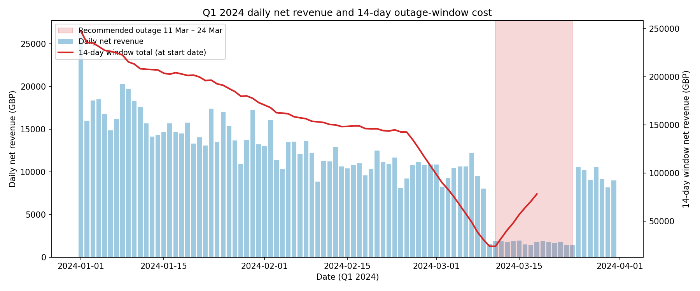
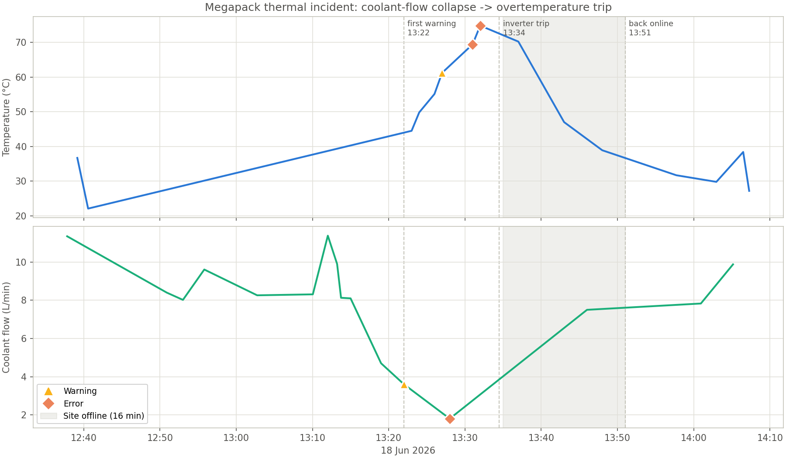

# Part 1, Maintenance Outage Recommendation

**Schedule the 14-day outage for 11–24 March 2024.**

Of every 14-day window in Q1, this one costs the least to be offline for: about
**£24k** of net revenue, versus roughly £150k for an average window and £247k for the
worst (early January). Picking it saves around £126k over scheduling the outage blind.

The reason is simply that March is the cheap part of the quarter (prices average
£33/MWh in March against £72/MWh in January), so the battery earns very little during
that fortnight anyway. The chart below shows daily net revenue (bars) and the running
14-day total (line); the shaded band is the recommended window, sitting right at the
bottom of the curve. As an independent check, the lowest-revenue single day in the whole
dataset (24 March) falls on the last day of this window.

All figures are *net* revenue (discharge income minus charging cost), which is the right
measure here: an offline site loses its discharge earnings but also stops paying to
charge.

# Part 2, Fleet Log Findings

**On 18 June a coolant-pump failure took the Megapack offline for 16 minutes.** Coolant
flow collapsed from its normal 6–11 L/min to 1.8 L/min in about ten minutes; with cooling
lost, temperature blew past the safe threshold (74.8°C, with a BMS module fault at
78.1°C), the BMS applied a thermal derate, and the inverter tripped on overtemperature,
triggering a protective site shutdown. Only 12.5 minutes elapsed between the first
warning (13:22) and the trip (13:34:30) — a tight but real intervention window. The site
recovered at 13:51 after the coolant pump restarted. This is an **internal fault**: the
evidence chain runs Thermal → BMS → Inverter → Site, with nothing grid-side.

Three days of logs contain three distinct issues, ranked by severity:

| # | When | Issue | Verdict | Action |
|---|------|-------|---------|--------|
| 1 | 18 Jun 13:22–13:51 | Coolant-flow loss → thermal trip → protective shutdown | Internal fault | **Inspect/replace the coolant pump before returning to full dispatch** — the restart fixed the symptom, not the cause |
| 2 | 17 Jun 12:04–16:04 | Battery Module 4 cell imbalance drifting 0.10→0.17 V over ~3 h, with SOC mismatches, ending in a critical voltage drop | Internal, progressive — no self-recovery | **Module 4 is flagged for inspection**; schedule cell-balancing diagnostics |
| 3 | 16 Jun 08:31–08:38 | Grid under-frequency (49.58 Hz) with repeated sync loss | External, self-resolving | None — the site rode through and re-synced on its own |

The two internal issues deserve a maintenance visit; the pump is urgent (it already
caused downtime), Module 4 is preventive (it hasn't tripped anything yet, but the trend
is one-directional). The grid event needs no action and shows the protection logic
distinguishing external disturbances correctly.

Full timelines, per-subsystem statistics and SQL detail: `outputs/part2_console_output.txt`.
A natural-language interface over these logs (summaries, plots, service tickets) is in
`agent/` — see `agent/transcript.md` for it answering the assignment's three prompts.
